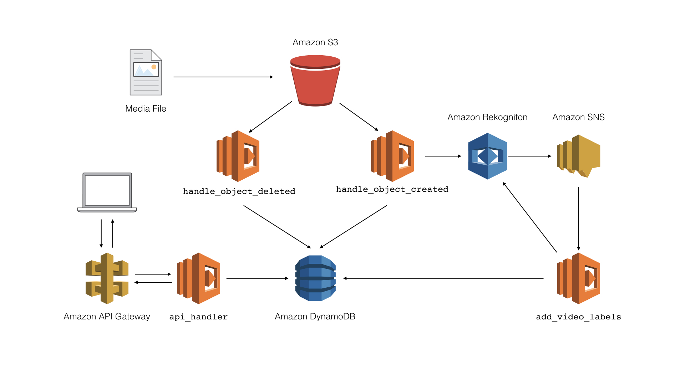

Media Query Application
=======================

This application allows users to query information about media files stored
in an Amazon S3 bucket. Queryable information includes names of files, media
file type, and detected objects in the media file.

Architecture
------------

Below is the architecture for the application

The main components of the application are as follows:

* ``handle_object_created``: A Lambda function that is triggered when an
  object is uploaded to a S3 bucket. If the object is an image, it will
  call Amazon Rekognition's ``DetectLabels`` API to detect objects in the
  image. With the detected objects, the Lambda function will then add the
  object to an Amazon DynamoDB table. If the object is a video, it will call
  Rekognition's ``StartLabelDetection`` API to initiate an asynchronous
  job to detect labels in the video. When the job is completed, a completion
  notification is pushed to an SNS topic.

* ``handle_object_deleted``: A Lambda function that removes the object from
  the DynamoDB table if the object is deleted from the S3 bucket.

* ``add_video_labels``: A Lambda function that is triggered on video label
  detection SNS messages. On invocation, it will call Rekognition's
  ``GetLabelDetection`` API to retrieve all detected objects from the video.
  It then adds the video with its labels to the DynamoDB Table

* ``api_handler``: A Lambda function that is invoked by HTTP requests to
  Amazon API Gateway. On invocation, it will query the database based on the
  received HTTP request and return the results to the user through API Gateway.

Deployment
----------

To deploy the application, first install the necessary requirements and
install the AWS CLI::

  $ pip install -r requirements.txt
  $ pip install awscli

Then use the AWS CLI to deploy a CloudFormation stack containing the S3 bucket,
DynamoDB table, and SNS topic needed to run this application::

  $ aws cloudformation deploy --template-file resources.json --stack-name media-query --capabilities CAPABILITY_IAM

Record the deployed resources as environment variables in the Chalice application by
running the `recordresources.py` script::

  $ python recordresources.py --stack-name media-query

Once those resources are created and recorded, deploy the Chalice application::

  $ chalice deploy

Using the Application
---------------------

Once the application is deployed, use the AWS CLI to fetch the name of the
bucket that is storing the media files:

   $ aws cloudformation describe-stacks --stack-name media-query --query "Stacks[0].Outputs[?OutputKey=='MediaBucketName'].OutputValue" --output text
   media-query-mediabucket-xtrhd3c4b59

Upload some sample media files to your Amazon S3 bucket so the system populates
information about the media files in your DynamoDB table::

   $ aws s3 cp assets/sample.jpg s3://media-query-mediabucket-xtrhd3c4b59/sample.jpg
   $ aws s3 cp assets/sample.mp4 s3://media-query-mediabucket-xtrhd3c4b59/sample.mp4

Wait about a minute for the media files to be populated in the database and
then install HTTPie::

    $ pip install httpie

Then, list out all if the media files using the application's API with HTTPie::

    $ chalice url
    https://qi5hf4djdg.execute-api.us-west-2.amazonaws.com/api/

    $ http https://qi5hf4djdg.execute-api.us-west-2.amazonaws.com/api/
    HTTP/1.1 200 OK
    Connection: keep-alive
    Content-Length: 279
    Content-Type: application/json
    Date: Tue, 10 Jul 2018 17:58:40 GMT
    Via: 1.1 fa751ee53e2bf18781ae98b293ff9375.cloudfront.net (CloudFront)
    X-Amz-Cf-Id: sNnrzvbdvgj1ZraySJvfSUbHthC_fok8l5GJ7glV4QcED_M1c8tlvg==
    X-Amzn-Trace-Id: Root=1-5b44f3d0-4546157e8f5e35a008d06d88;Sampled=0
    X-Cache: Miss from cloudfront
    x-amz-apigw-id: J0sIlHs3vHcFj9g=
    x-amzn-RequestId: e0aaf4e1-846a-11e8-b756-99d52d342d60

    [
        {
            "labels": [
                "Animal",
                "Canine",
                "Dog",
                "German Shepherd",
                "Mammal",
                "Pet",
                "Collie"
            ],
            "name": "sample.jpg",
            "type": "image"
        },
        {
            "labels": [
                "Human",
                "Clothing",
                "Dog",
                "Nest",
                "Person",
                "Footwear",
                "Bird Nest",
                "People",
                "Animal",
                "Husky"
            ],
            "name": "sample.mp4",
            "type": "video"
        }
    ]
You can include query string parameters as well to query all objects based
on what the file name starts with, the type of the media file, and the detected
objects in the media file::

    $ http https://qi5hf4djdg.execute-api.us-west-2.amazonaws.com/api/ startswith==sample.m
    HTTP/1.1 200 OK
    Connection: keep-alive
    Content-Length: 153
    Content-Type: application/json
    Date: Tue, 10 Jul 2018 19:20:02 GMT
    Via: 1.1 aa42484f82c16d99015c599631def20c.cloudfront.net (CloudFront)
    X-Amz-Cf-Id: euqlOlWN5k5V_zKCJy4SL988Vcje6W5jDR88GrWr5uYGH-_ZvN4arg==
    X-Amzn-Trace-Id: Root=1-5b4506e0-db041a3492ee56e8f3d9457c;Sampled=0
    X-Cache: Miss from cloudfront
    x-amz-apigw-id: J04DHE92PHcF--Q=
    x-amzn-RequestId: 3d82319d-8476-11e8-86d9-a1e4585e5c26

    [
        {
            "labels": [
                "Human",
                "Clothing",
                "Dog",
                "Nest",
                "Person",
                "Footwear",
                "Bird Nest",
                "People",
                "Animal",
                "Husky"
            ],
            "name": "sample.mp4",
            "type": "video"
        }
    ]

    $ http https://qi5hf4djdg.execute-api.us-west-2.amazonaws.com/api/ media-type==image
    HTTP/1.1 200 OK
    Connection: keep-alive
    Content-Length: 126
    Content-Type: application/json
    Date: Tue, 10 Jul 2018 19:20:53 GMT
    Via: 1.1 88eb066576c1b47cd896ab0019b9f25f.cloudfront.net (CloudFront)
    X-Amz-Cf-Id: rwuOwzLKDM4KgcSBXFihWeNNsYSpZDYVpc8IXdT0xOu8qz8aA2Pj3w==
    X-Amzn-Trace-Id: Root=1-5b450715-de71cf04ca2900b839ff1194;Sampled=0
    X-Cache: Miss from cloudfront
    x-amz-apigw-id: J04LaE6YPHcF3VA=
    x-amzn-RequestId: 5d29d59a-8476-11e8-a347-ebb5d5f47789

    [
        {
            "labels": [
                "Animal",
                "Canine",
                "Dog",
                "German Shepherd",
                "Mammal",
                "Pet",
                "Collie"
            ],
            "name": "sample.jpg",
            "type": "image"
        }
    ]

    $ http https://qi5hf4djdg.execute-api.us-west-2.amazonaws.com/api/ label==Person
    HTTP/1.1 200 OK
    Connection: keep-alive
    Content-Length: 153
    Content-Type: application/json
    Date: Tue, 10 Jul 2018 19:20:02 GMT
    Via: 1.1 aa42484f82c16d99015c599631def20c.cloudfront.net (CloudFront)
    X-Amz-Cf-Id: euqlOlWN5k5V_zKCJy4SL988Vcje6W5jDR88GrWr5uYGH-_ZvN4arg==
    X-Amzn-Trace-Id: Root=1-5b4506e0-db041a3492ee56e8f3d9457c;Sampled=0
    X-Cache: Miss from cloudfront
    x-amz-apigw-id: J04DHE92PHcF--Q=
    x-amzn-RequestId: 3d82319d-8476-11e8-86d9-a1e4585e5c26

    [
        {
            "labels": [
                "Human",
                "Clothing",
                "Dog",
                "Nest",
                "Person",
                "Footwear",
                "Bird Nest",
                "People",
                "Animal",
                "Husky"
            ],
            "name": "sample.mp4",
            "type": "video"
        }
    ]

You can also query for a specific object::

    $ http https://qi5hf4djdg.execute-api.us-west-2.amazonaws.com/api/sample.jpg
    HTTP/1.1 200 OK
    Connection: keep-alive
    Content-Length: 126
    Content-Type: application/json
    Date: Tue, 10 Jul 2018 19:20:53 GMT
    Via: 1.1 88eb066576c1b47cd896ab0019b9f25f.cloudfront.net (CloudFront)
    X-Amz-Cf-Id: rwuOwzLKDM4KgcSBXFihWeNNsYSpZDYVpc8IXdT0xOu8qz8aA2Pj3w==
    X-Amzn-Trace-Id: Root=1-5b450715-de71cf04ca2900b839ff1194;Sampled=0
    X-Cache: Miss from cloudfront
    x-amz-apigw-id: J04LaE6YPHcF3VA=
    x-amzn-RequestId: 5d29d59a-8476-11e8-a347-ebb5d5f47789

    [
        {
            "labels": [
                "Animal",
                "Canine",
                "Dog",
                "German Shepherd",
                "Mammal",
                "Pet",
                "Collie"
            ],
            "name": "sample.jpg",
            "type": "image"
        }
    ]
