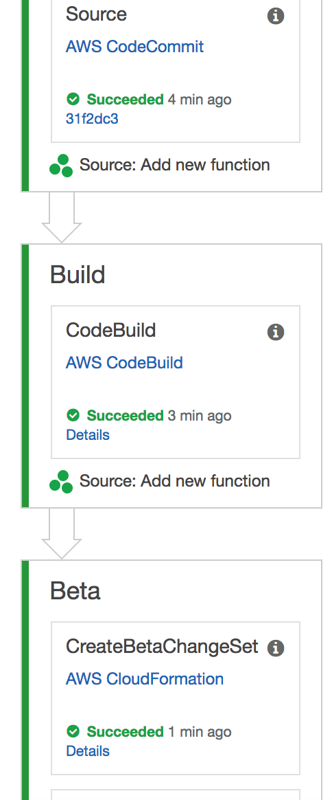

Section 2: Working with AWS CodePipeline
========================================

In this section, we'll create a CodePipeline for our sample chalice app.

Creating a pipeline
-------------------

AWS Chalice provides a command for generating a starter template.
This template is managed through an AWS CloudFormation stack.

Instructions
~~~~~~~~~~~~

1. Create a ``release/`` directory.  We'll place CD related files
   in this directory::

    $ mkdir release/

2. Generate a CloudFormation template for our starter CD pipeline::

    $ chalice generate-pipeline release/pipeline.json

3. Deploy this template using the AWS CLI::

    $ aws cloudformation deploy --stack-name chalice-pipeline-stack \
        --template-file release/pipeline.json \
        --capabilities CAPABILITY_IAM

This last command may take up a few minutes to deploy.

Configuring git
---------------

Up to this point, we have not been using any source control to track
our changes to our sample app.  We're now going to create and configure
a git repo along with an AWS CodeCommit remote.  If you haven't set up
git, you can follow the instructions in the :ref:`git-setup` section.

Instructions
~~~~~~~~~~~~

1. Initialize your sample app as a git repository::

    $ git init .
    $ cp ../chalice-workshop/code/part2/02-pipeline/.gitignore .

2. Commit your existing files::

    $ git add -A .
    $ git commit -m "Initial commit"

3. Query the CloudFormation stack you created in the previous step for
   the value of the remote repository::

    $ aws cloudformation describe-stacks \
        --stack-name chalice-pipeline-stack \
        --query Stacks[0].Outputs
    [
        ...
        {
            "OutputKey": "SourceRepoURL",
            "OutputValue": "https://git-codecommit.us-west-2.amazonaws.com/v1/repos/mytodo"
        },
        ...
    ]

4. Copy the value for the ``SourceRepoURL`` and configure a new git remote named
   ``codecommit``.  Be sure to use your value of the ``SourceRepoURL``::

    $ git remote add codecommit https://git-codecommit.us-west-2.amazonaws.com/v1/repos/mytodo

5. Configure the CodeCommit credential helper.  Append these lines to the end
   of your ``.git/config`` file::

    [credential]
        helper =
        helper = !aws codecommit credential-helper $@
        UseHttpPath = true

Verification
~~~~~~~~~~~~

1. Verify you have a ``codecommit`` remote::

    $ git remote -v
    codecommit	https://git-codecommit.us-west-2.amazonaws.com/v1/repos/mytodo (fetch)
    codecommit	https://git-codecommit.us-west-2.amazonaws.com/v1/repos/mytodo (push)

2. Verify the credential helper is installed correctly.  Mac users may see an
   ``osxkeychain`` entry as the first line of output.  This is expected, you
   just need to verify the last two lines match the output below::

    $ git config -l | grep helper
    credential.helper=osxkeychain
    credential.helper=
    credential.helper=!aws codecommit credential-helper $@

3. Verify you can fetch from the ``codecommit`` remote::

    $ git fetch codecommit
    $ echo $?
    0

Pushing your changes to AWS CodeCommit
--------------------------------------

Now we have our pipeline and git remote configured, anytime we push
changes to our ``codecommit`` remote, our pipeline will automatically
deploy our app.

Instructions
~~~~~~~~~~~~

1. Push your changes to the ``codecommit`` remote::

    $ git push codecommit master
    Counting objects: 23, done.
    Delta compression using up to 4 threads.
    Compressing objects: 100% (18/18), done.
    Writing objects: 100% (23/23), 9.82 KiB | 3.27 MiB/s, done.
    Total 23 (delta 2), reused 0 (delta 0)
    To https://git-codecommit.us-west-2.amazonaws.com/v1/repos/mytodo
     * [new branch]      master -> master

Verification
~~~~~~~~~~~~

The best way to verify the pipeline is working as expected is to view
the pipeline in the console:

1. Log in to the AWS Console at https://console.aws.amazon.com/

2. Go to the CodePipeline page.

3. Click on the "mytodoPipeline" pipeline.

.. image:: ../img/pipeline-landing.png
   :scale: 50 %

4. You should see a "Source", "Build", and "Beta" stage.

5. It can take a few minutes after pushing a change before the pipeline
   starts.  If your pipeline has not started yet, wait a few minutes and
   refresh the page.  Once the pipeline starts, it will take about 10 minutes
   for the intial deploy.

.. image:: ../img/pipeline-started.png
   :scale: 50 %

Wait until the stages have completed and all the stages are green.

6. Place your mouse over the "i" icon.  Note the value of the **Stack name**.
   It should be something like ``mytodoBetaStack``.

.. image:: ../img/pipeline-stack-name.png
   :scale: 50 %

7. Query for the stack output of ``EndpointURL`` using the AWS CLI.  This is
   the same step we performed in the previous section::

    $ aws cloudformation describe-stacks --stack-name mytodoBetaStack \
        --query Stacks[0].Outputs
    [
        {
            "OutputKey": "APIHandlerArn",
            "OutputValue": "arn:aws:lambda:us-west-2:123:function:..."
        },
        {
            "OutputKey": "APIHandlerName",
            "OutputValue": "..."
        },
        {
            "OutputKey": "RestAPIId",
            "OutputValue": "abcd"
        },
        {
            "OutputKey": "EndpointURL",
            "OutputValue": "https://your-chalice-url/api/"
        }
    ]

8. Use the value for ``EndpointURL`` to test your API by creating
   a new Todo item::

    $ echo '{"description": "My third Todo", "metadata": {}}' | \
        http POST https://your-chalice-url/api/todos
    HTTP/1.1 200 OK
    Content-Length: 36
    Content-Type: application/json

    abcdefg-abcdefg

9. Verify you can retrieve this item::

    $ http https://your-chalice-url/todos/abcdefg-abcdefg
    HTTP/1.1 200 OK
    Content-Length: 140
    Content-Type: application/json

    {
        "description": "My third Todo",
        "metadata": {},
        "state": "unstarted",
        "uid": "abcdefg-abcdefg",
        "username": "default"
    }

Deploying an update
-------------------

Now we'll make a change to our app and commit/push our change
to CodeCommit.  Our change will automatically be deployed.

Instructions
~~~~~~~~~~~~

1.  At the bottom of your ``app.py`` file, add a new test route:

    .. code-block:: python

        @app.route('/test-pipeline')
        def test_pipeline():
            return {'pipeline': 'route'}

2. Commit and push your changes::

    $ git add app.py
    $ git commit -m "Add test view"
    $ git push codecommit master
    Counting objects: 3, done.
    Delta compression using up to 4 threads.
    Compressing objects: 100% (3/3), done.
    Writing objects: 100% (3/3), 357 bytes | 357.00 KiB/s, done.
    Total 3 (delta 2), reused 0 (delta 0)
    To https://git-codecommit.us-west-2.amazonaws.com/v1/repos/mytodo
       4ded202..31f2dc3  master -> master

Verification
~~~~~~~~~~~~

1. Go back to the AWS Console page for your CodePipeline named "mytodoPipeline".
2. Refresh the page.  You should see the pipeline starting again.  If you're not
   seeing any changes, you may need to wait a few minutes and refresh.
3. Wait for the pipeline to finish deploying.
4. Once it's finished verify the new test route is available.  Use the
   same ``EndpointURL`` from the previous step::

    $ http https://your-chalice-url/api/test-pipeline
    HTTP/1.1 200 OK
    Connection: keep-alive
    Content-Length: 21
    Content-Type: application/json
    ...

    {
        "pipeline": "route"
    }

Extract the buildspec to a file
-------------------------------

The instructions for how CodeBuild should package our app
lives in the ``release/pipeline.json`` CloudFormation template.
CodeBuild also supports loading the build instructions from
a ``buildspec.yml`` file at the top level directory of your app.
In this step we're going to extract out the build spec from
the inline definition of the ``release/pipeline.json`` into a
``buildspec.yml`` file.  This will allow us to modify how CodeBuild
should build our app without having to redeploy our pipeline stack.

Instructions
~~~~~~~~~~~~

1. Remove the ``BuildSpec`` key from your ``release/pipeline.json``
   file.  Your existing template has this section::

    "Resources": {
      "AppPackageBuild": {
        "Type": "AWS::CodeBuild::Project",
          "Source": {
            "BuildSpec": " ... long string here ...",
            "Type": "CODEPIPELINE"
          }
        }
    ...

   And after removing the ``BuildSpec`` key it should look like this::

    "Resources": {
      "AppPackageBuild": {
        "Type": "AWS::CodeBuild::Project",
          "Source": {
            "Type": "CODEPIPELINE"
          }
        }
    ...

2. Redeploying your pipeline stack using the AWS CLI::

    $ aws cloudformation deploy --stack-name chalice-pipeline-stack \
        --template-file release/pipeline.json \
        --capabilities CAPABILITY_IAM

3. At the top level directory of your sample app, create a new file
   named ``buildspec.yml`` with these contents::

    version: 0.1
    phases:
      install:
        commands:
          - sudo pip install --upgrade awscli
          - aws --version
          - sudo pip install chalice
          - sudo pip install -r requirements.txt
          - chalice package /tmp/packaged
          - aws cloudformation package --template-file /tmp/packaged/sam.json --s3-bucket ${APP_S3_BUCKET} --output-template-file transformed.yaml
    artifacts:
      type: zip
      files:
        - transformed.yaml

4. Commit the ``buildspec.yml`` file and push your changes to CodeCommit::

    $ git add buildspec.yml
    $ git commit -m "Adding buildspec.yml"
    $ git push codecommit master

Verification
~~~~~~~~~~~~

1. Go to the CodePipeline page in the console.
2. Wait for the pipeline to deploy your latest changes. Keep in
   mind that there should be no functional changes, we just want
   to verify that CodeBuild was able to load the ``buildspec.yml`` file.

Run unit tests
--------------

Now we're going to modify our ``buildspec.yml`` file to run our unit
tests.  If the tests fail our application won't deploy to our Beta stage.

Instructions
~~~~~~~~~~~~

1. Create a new ``build.sh`` script with these contents::

    #!/bin/bash
    pip install --upgrade awscli
    aws --version
    pip install virtualenv
    virtualenv /tmp/venv
    . /tmp/venv/bin/activate
    pip install -r requirements.txt
    pip install -r requirements-test.txt
    pip install chalice
    export PYTHONPATH=.
    py.test tests/ || exit 1
    chalice package /tmp/packaged
    aws cloudformation package --template-file /tmp/packaged/sam.json --s3-bucket "${APP_S3_BUCKET}" --output-template-file transformed.yaml

2. Make the script executable::

    $ chmod +x ./build.sh

3. Update your ``buildspec.yml`` to call this build script::

    version: 0.1
    phases:
      install:
        commands:
          - sudo -E ./build.sh
    artifacts:
      type: zip
      files:
        - transformed.yaml

4. Commit your changes and push them to codecommit::

    $ git add build.sh buildspec.yml
    $ git commit -m "Run unit tests"

Verification
~~~~~~~~~~~~

1. Refresh your pipeline in the AWS console.
2. Verify the pipeline successfully completes.

Add a failing test
------------------

Now we'll add a failing unit test and verify that our
application does not deploy.

Instructions
~~~~~~~~~~~~

1. Add a failing test to the end of the ``tests/test_db.py`` file::

    def test_fail():
        assert 0 == 1

2. Commit and push your changes::

    $ git add tests/test_db.py
    $ git commit -m "Add failing test"
    $ git push codecommit master

Verification
~~~~~~~~~~~~

1. Refresh your pipeline in the AWS console.
2. Verify that the CodeBuild stage fails.
